uniapp与php（后台服务器）的交互登录，界面，接口，cookies，session
============================================

0.目录

[1.前言](#p1)

[2.uniapp前端](#p2)

[3.后端接口](#p3)

[4.uniapp与后端交互](#p4)

[5.结果](#p5)

1.前言
----
建议直接看【readme.html】文件，【有颜色标识】，本md文件不保证图片正确显示

uniapp是一个使用html5标准的，一次开发，可以发布到安卓，ios，小程序的多端框架。非常方便。

这是一个非常基础的demo，面向于近乎无经验的朋友们。更重要的是指导按什么顺序看这篇demo文件。字有点多，比较乱，只能抱歉一条条看了。本来想做一个完全手把手教程，也就是视频。但发现自己的表达过于贫瘠，只能做一个文字版的了。文字版过程将简单一点。

本demo分为前端和后端两部分，

前端部分为简单登录模板，没有引用任何外部css，较为简单，并做了简单合法性校验。您可以拿去用，来少写几个输入框。登录保持用的是传统web的session（cookies）机制。符合传统开发习惯。本demo不含微信等的快捷登录，为传统手机号登录。

后端采用php，结构较为简单。数据库为mysql，使用了预处理，保证了数据库安全，您可以放心使用。在下面的部分会有详细讲解，包括POST传值，接口，session。

如果您想请我喝一杯咖啡(以示鼓励)，[可以点击这里（跳至页面底部）](#coffee)

2.uniapp前端
----------

首先，务必看一下官方视频教程，在官方文档首页如何学习里有链接。

本demo制作时的流程：

1.先制作界面，先不写js逻辑。新建“indexme”界面，在pages.json文件中，配置tabbar。其中图标可在阿里云图标库（https://www.iconfont.cn/ ）下载，下载png格式时，可直接指定颜色，大小为81。json与效果如下：

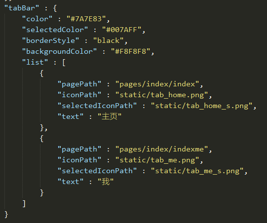 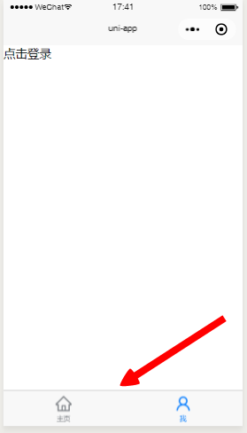

2.新建login/register/logot界面，来绘制登录、注册、退出页面。绘制输入框，并在js中对输入框的合法性进行简单验证。（先不写网络交互逻辑。）之后补全页面跳转逻辑。

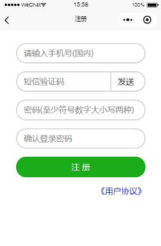 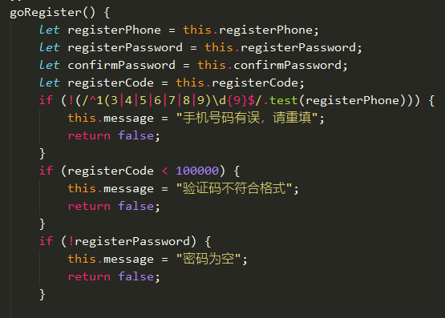 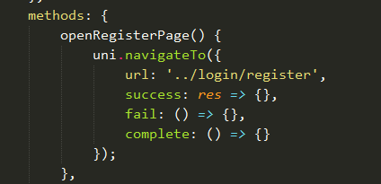

以上截图分别为界面，合法性校验，页面跳转。

3.后端接口
------

1.php搭建环境较为简单，安装xampp即可，如果端口占用，记得需要配置端口，百度有方法。数据库端口如果没有冲突就不配置。启动php环境（根据百度查看自己是否成功）。文件需要放到htdocs文件夹。

2.如果你想直接看看本demo后端效果。将本demo的htdocs文件夹放到对应位置后。打开刚刚安装的xampp，打开数据库可视页面，新建数据库（你喜欢的名字），在本demo的config文件夹修改数据库名字。之后，在你选择的数据库中，执行本demo的sql文件夹中的sql语句进行建表。 在htdocs的很目录里，有一个test.php，你可以使用它来向你本地网址post数据来测试登录效果。test2.php是可以刷新看看你登录没有

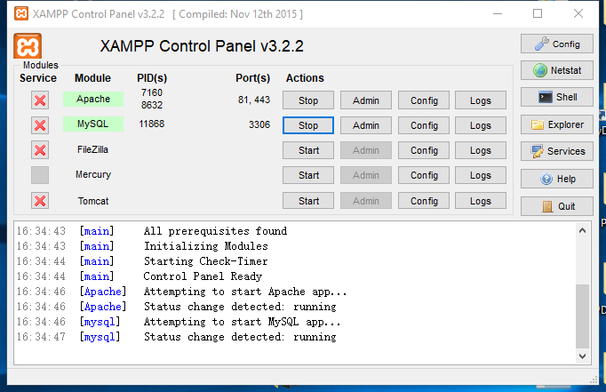 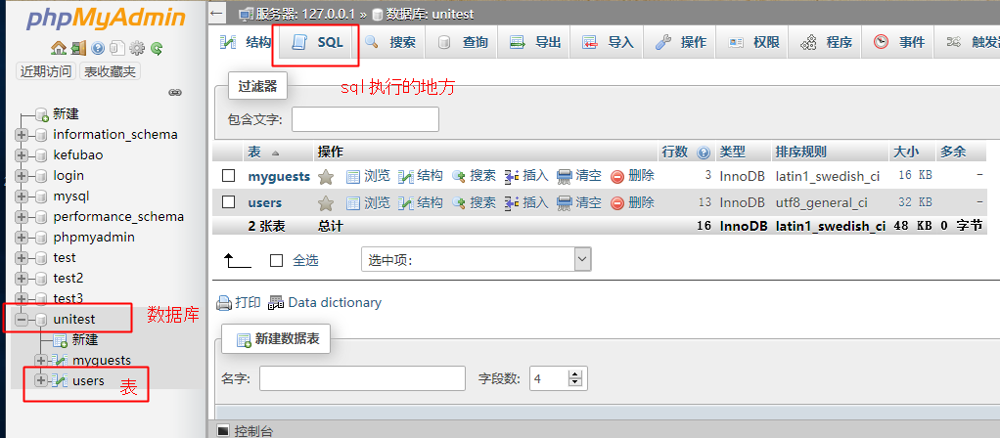 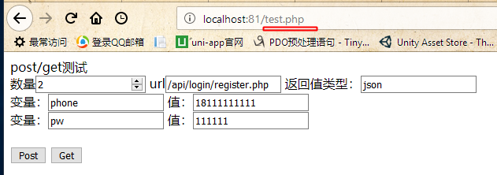 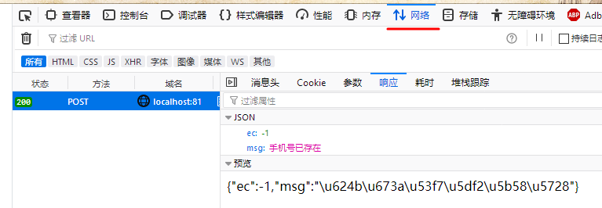 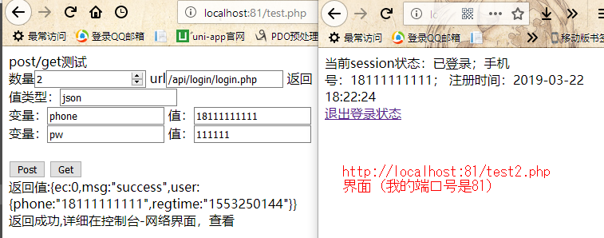

以上截图分别是xampp界面、数据库可视界面、测试界面，点按post后的网络请求。登录测试

浏览器测试时，请按F12打开开发者工具，查看网络请求选项里的网络请求。请使用火狐或谷歌浏览器。

这些就是常规web登录的登录原理。

**3.php文件通过$_POST\['phone'\]来接受前台传过来的“phone”变量，接受到变量，自然就可以处理了，你可以去login.php文件看一下，代码行数较少，比较容易看明白。这些接口**

4、连接数据库，数据库的配置文件提出来，在文件上面引用，多个文件用。使用预处理，防止数据库注入攻击。

3、4的教程可以通读：http://www.runoob.com/php/php-tutorial.html

4.uniapp与后端交互
-------------

uni的请求，除了h5端，是不挟带cookies的，刚刚第二大部分，是使用cookies进行传输session信息。所以我们需要构建请求头。如有返回回来的cookies，保存到本地储存里。详见login.vue文件（比较长，此处不再截图）。现在，在第一部分uniapp的前端的js中，补齐网络请求。（分别在login，register，logout，和index中，index中的是为了第一次打开事判断登录状态）

本demo没有做session过期的判断，您可以做上。

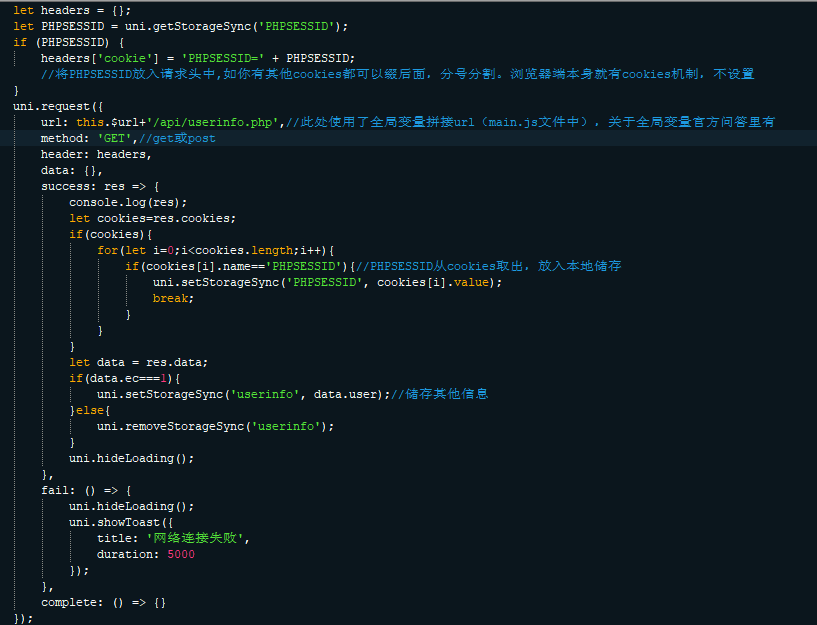

5.结果
----

登录后，本地保存了session，您如果需要什么网络请求，带上它就好了，就知道谁发过来的，而不用查询数据库。关闭app后，重新打开，仍在登录状态

支持我：
----

如果您想请我喝一杯咖啡(以示鼓励)，那非常感谢，或在插件页面评分。本篇与源码无转载限制，随意使用。

如果那一段不太明白，在uni插件市场提出就可以~我会再去补充~

 
